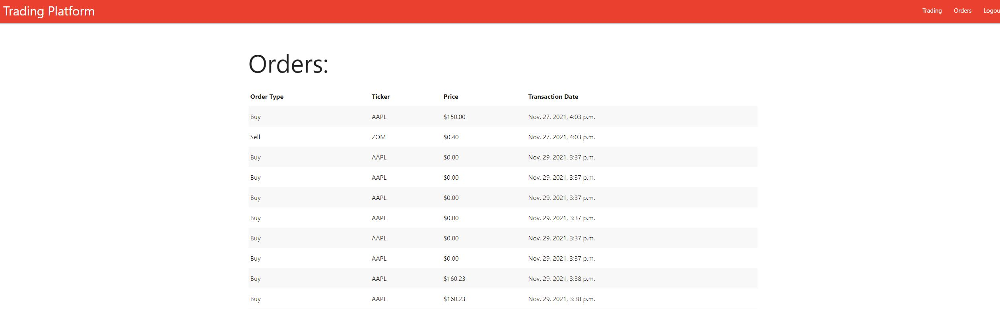
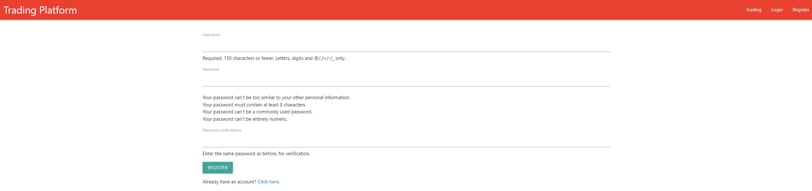
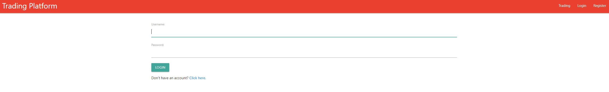

#  MockStockTradingPlatform

Django Mock Stock Trading Platform

## Description

This project uses Python and Django to create a website that mimicks a brokerage. There is user registration and login and it keeps track of which stock the user buys or sells. The user can also search for any stock and get a candlestick chart of the recent trading prices. It uses the Alpaca Markets api to get stock prices.

## Images

## Technologies Used

Python, Django, HTML, CSS, Javascript, Google Charts, Alpaca Markets API

## Improvements

- Add variable time frames to candlestick chart.
- Change colors and design to be more aesthetic.
- Account value and holdings

## License

This project is licensed under the  MIT License - see the LICENSE file for details.
